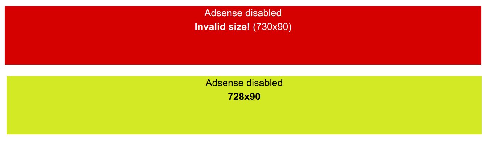

[](https://packagist.org/packages/geertw/yii2-adsense)
[](https://packagist.org/packages/geertw/yii2-adsense)
[](https://packagist.org/packages/geertw/yii2-adsense)

Google AdSense widget
=====================

Yii2 widget for displaying Google AdSense banners. This widget provides a convenient method for displaying
Adsense banners in Yii2 templates.

This widget also makes it easy to disable Adsense, which can be useful for development.
When disabled, this widget shows a dummy banner with the actual banner size and an indication
whether this is a valid banner size for AdSense.



Installation
------------

The preferred way to install this extension is through [composer](http://getcomposer.org/download/).

Either run

```
composer require geertw/yii2-adsense
```

or add

```
"geertw/yii2-adsense": "*"
```

to the require section of your `composer.json` file.


Configuration
-------------

You may configure application-wide settings using Yii2 params, or you can configure the widget per instance.

You must configure the settings `client`, `slot` and `enabled` in order to display banners.

In your params configuration:

```php
<?php
return [
    'adsense' => [
        'client'  => 'ca-pub-1234567890123456',
        'slot'    => '1234567890',
        'enabled' => true,
    ],
];
```

You may override these when calling the widget.

Usage
-----

Once the extension is installed and configured, simply use it in your code like this:

```php
<div style="width: 728px; height: 90px">
    <?= \geertw\Yii2\Adsense\AdsenseWidget::widget(); ?>
</div>

```

If you want a non-default slot ID, or when you want to change other settings, use:

```php
<div style="width: 728px; height: 90px">
    <?= \geertw\Yii2\Adsense\AdsenseWidget::widget(['slot' => '9012345678']); ?>
</div>

```

Configuration options
---------------------

The following options are available:

* `client` - AdSense client ID
* `slot` - AdSense slot ID
* `enabled` - whether AdSense is enabled (defaults to false)
* `responsive` - whether to use responsive ad blocks (defaults to true)
* `visible` - whether the banner is visible at all (defaults to true)

When `enabled` is false, a dummy banner will be displayed. This banner shows the actual banner size and depending
on the size, the banner is green for valid AdSense banner sizes and red for unknown banner sizes.

When `visible` is false, no banner at all is shown. This overrules `enabled`.
